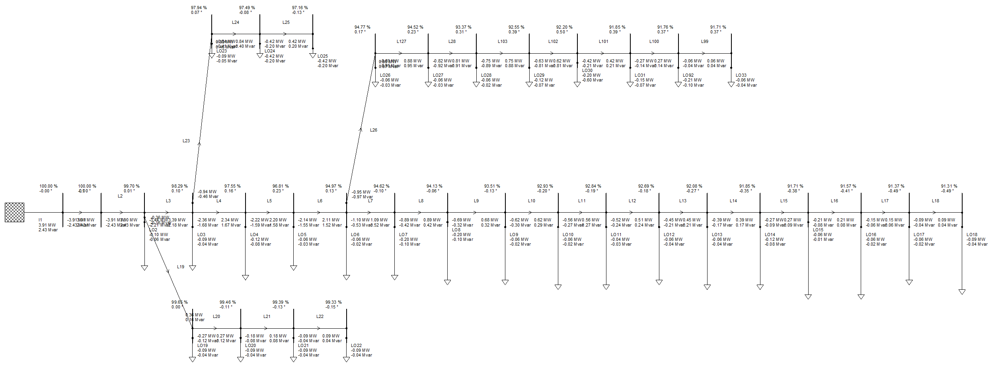
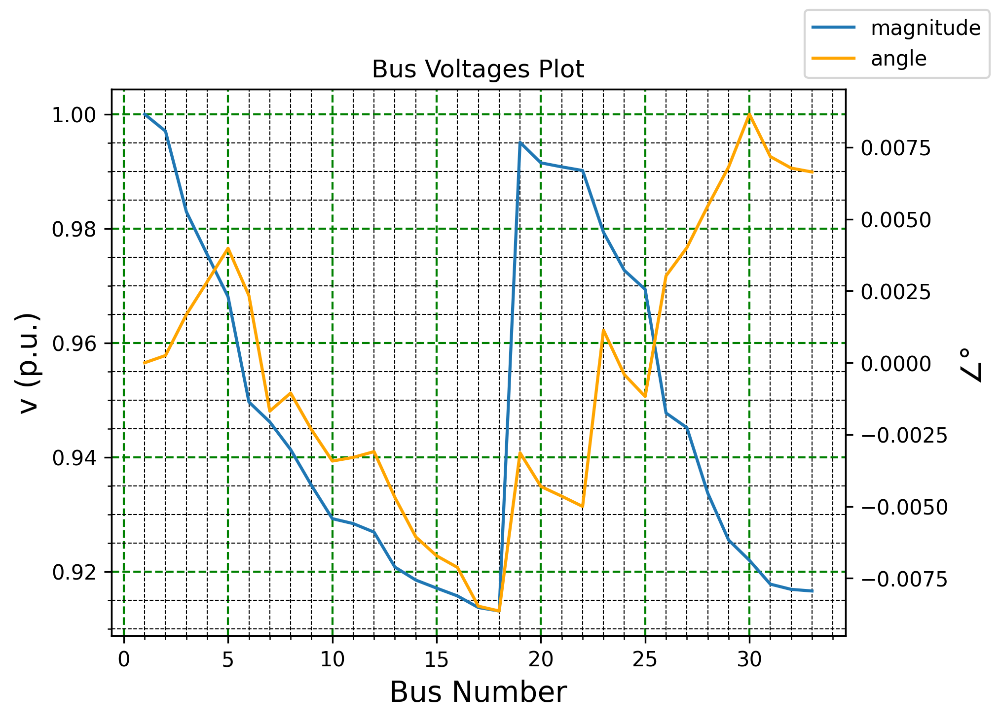
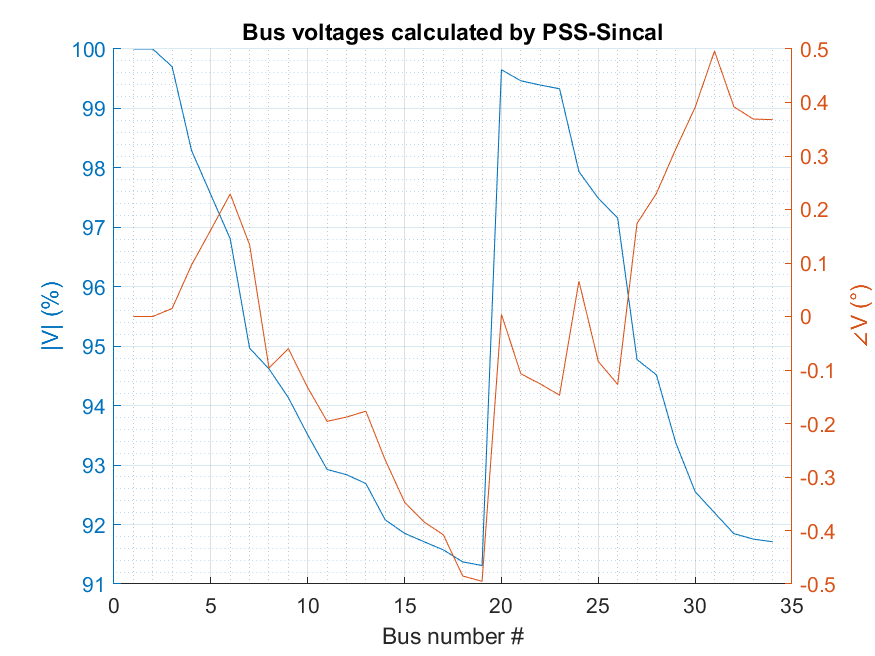
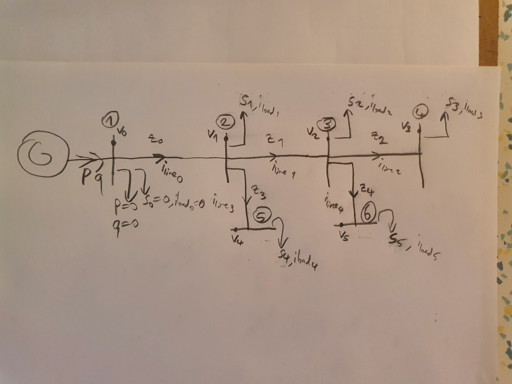

# ForwardBackwardSweep
 Power flow analysis using forward backward sweep method.

# Setup
1. Launch command prompt in the directory where the `main.py` is.
2. Run `pip install -r requirements.txt`

# Usage
1. Configure the `config.json` 
1. Enter the bus data into `busIn.xlsx` 
    - Real: kW
    - Reactive: kVAR

2. Enter the line data into `lineIn.xlsx` 
    - From bus: #
    - To bus: #
    - Resistance: Ω
    - Reactance: Ω

3. Run  `main.py`. It will generate the necessary csv files.

4. OR Run  `run.bat`.

# IEEE 33-Bus 
## The Topology

## Results

# Comparison with Siemens PSS-Sincal
## Sincal's Results

## Deviation from Sincal's Results

# Old Test Data Visualization

# Credits

https://www.researchgate.net/figure/Line-data-of-power-system_tbl1_264849305
https://www.youtube.com/watch?v=LrO0denD0lk
https://www.youtube.com/watch?v=pHB4NGvb-10

- 33 bus sample data: https://www.youtube.com/watch?v=4eabTjqmF-g